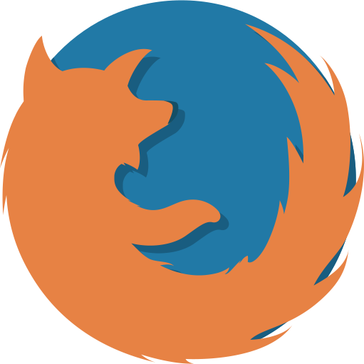

# Variable Position Sticky Nav

Tested and verified in:

View the [demo here](https://the0newhoknocks.github.io/react.sticky-left-nav/).

---

## Task

Create a UI that:
- Has a header UI that sticks below the top nav when they touch.
  - When the header becomes sticky, the header text should animate to a smaller
    size and visa versa once the header is un-stuck.
- Has a left nav that acts like a scrollbar. By that I mean, a scrollbar works
  on the basis that the bar is bound by the track it resides in, but can flow
  freely within that vertical area. In this case the nav's position isn't
  controlled by direct user interaction, but rather the scroll position of the
  page.
- If the nav is small enough to fit within the bounds, have it fixed to the top.
- If the nav is taller than the bounds:
  - **Scrolling down**: scroll with the page until the bottom of the nav is in
    view. Once that occurs stick to the bottom of the bounds, or stick to the
    bottom of the track if it's in view.
  - **Scrolling up**: scroll with the page until the top of the nav is in view.
    Once that occurs stick to the top of the bounds, or stick to the top of the
    track if it's in view.
- When opening an accordion item within the left nav, the nav should re-position
  itself depending on it's new height.
- When selecting an item within the accordion, a button to clear the selected
  items should appear at the bottom of the nav.
  - The button should display the number of items selected.
  - The button should overlay the menu if not at the bottom of the nav track.
  - The button should stick to the bottom of the nav if the button is at the
    bottom of the track's bounds.

---

## What Worked

- Used `position: sticky` for the header to prevent choppy transition.
  - Loading a polyfill for IE11
- Position/bounds detection for nav while scrolling
- Creating `Position` components that separate the business logic from the
  actual component. That way layout can be addressed differently in other
  experiences but the underlying functionality will remain.
- Creating a very simplistic Storbook-esque GUI (the tab at the center right)
  to allow for adding variable amounts of products, categories, filter groups,
  and filter items.

---

## What Didn't Work
- Tried to utilize `IntersectionObserver`, but it would miss certain detections
  if the user scrolled very quickly moving a point from the bottom (out of view)
  to the top (out of view); leading to false positives/negatives.
- Calculating position for header. Tried to keep both experiences similar,
  either position calculation, or pure CSS, but the transition was smoother
  utilizing `position: sticky` for the header.
